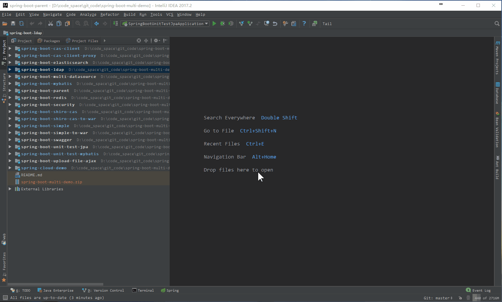
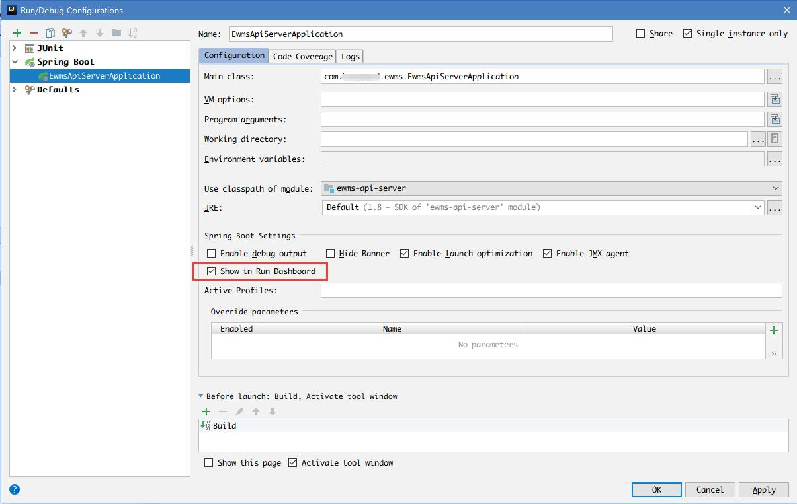

# IntelliJ IDEA 常用设置讲解

## 说明

IntelliJ IDEA 有很多人性化的设置我们必须单独拿出来讲解，也因为这些人性化的设置让我们这些 IntelliJ IDEA 死忠粉更加死心塌地使用它和分享它。

## 常用设置

> * 如上图标注 1 所示，在打开很多文件的时候，IntelliJ IDEA 默认是把所有打开的文件名 Tab 单行显示的。但是我个人现在的习惯是使用多行，多行效率比单行高，因为单行会隐藏超过界面部分 Tab，这样找文件不方便。

> * 如上图 Gif 所示，默认 IntelliJ IDEA 对于 Java 代码的单行注释是把注释的斜杠放在行数的最开头，我个人觉得这样的单行注释非常丑，整个代码风格很难看，所以一般会设置为单行注释的两个斜杠跟随在代码的头部。

> * 如上图 Gif 所示，默认 Java 代码的头个花括号是不换行的，但是有人喜欢对称结构的花括号，可以进行此设置。对于此功能我倒是不排斥，我个人也是颇喜欢这种对称结构的，但是由于这种结构会占行，使得文件行数变多，所以虽然我个人喜欢，但是也不这样设置。

> * 如上图标注 1 所示，如果在 make 或 rebuild 过程中很慢，可以增加此堆内存设置，一般大内存的机器设置 `1500` 以上都是不要紧的。

> * 如上图标注 1 所示，勾选此选项后，启动 IntelliJ IDEA 的时候，默认会打开上次使用的项目。如果你只有一个项目的话，该功能还是很好用的，但是如果你有多个项目的话，建议还是关闭，这样启动 IntelliJ IDEA 的时候可以选择最近打开的某个项目。
> * 如上图红圈所示，该选项是设置当我们已经打开一个项目窗口的时候，再打开一个项目窗口的时候是选择怎样的打开方式。

>> * `Open project in new window` 每次都使用新窗口打开。
>> * `Open project in the same window` 每次都替换当前已打开的项目，这样桌面上就只有一个项目窗口。
>> * `Confirm window to open project in` 每次都弹出提示窗口，让我们选择用新窗口打开或是替换当前项目窗口。

> * 如上图 Gif 所示，对于横向太长的代码我们可以进行软分行查看。软分行引起的分行效果是 IntelliJ IDEA 设置的，本质代码是没有真的分行的。

> * 如上图箭头所示，该设置可以增加 `Ctrl + E` 弹出层显示的记录文件个数。

> * 如上图箭头所示，该设置可以增加打开的文件 Tab 个数，当我们打开的文件超过该个数的时候，早打开的文件会被新打开的替换。

> * 如上图标注 1 所示，该区域的后缀类型文件在 IntelliJ IDEA 中将以标注 2 的方式进行打开。
> * 如上图标注 3 所示，我们可以在 IntelliJ IDEA 中忽略某些后缀的文件或是文件夹，比如我一般会把 `.idea` 这个文件夹忽略。

> * 如上图 Gif 所示，这是一个 Maven 多模块项目，在开发多模块的时候，经常会改到其他模块的代码，而模块与模块之间是相互依赖，如果不进行 install 就没办法使用到最新的依赖。
> * 所以，为了减少自己手动 install 的过程，可以把 install 过程放在项目启动之前，就像 Gif 所示那样。

> * 默认 IntelliJ IDEA 是没有开启自动帮你生成 serialVersionUID 的，需要我们自行设置。
> * 如上图第一张，需要先勾选：`Serializable class without serialVersionUID`
> * 如上图第二张，在已经继承了 Serializable 接口的类名上，把光标放在类名上（必须这样做），按 `Alt + Enter`，即可提示帮你生成 serialVersionUID 功能。

> * 如上图 gif 演示的：Load/Unload Modules 是 2017.2 引入的新特性，对于多模块的项目开发 Unload 部分少用到的模块可以减少计算机 CPU 和内存的消耗。

> * 如上图所示 'Show in Run Dashboard'，在 2017.2.3 以后可以统一在一个 Tab 中管理所以模块应用。
> * 这对于开发分布式系统（Spring Boot / Spring Cloud）来讲非常方便。

